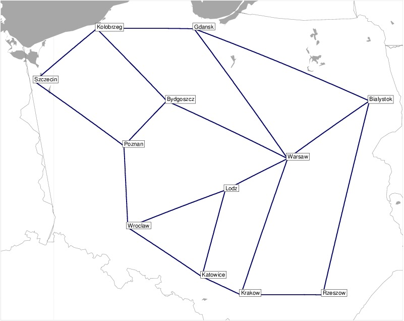

# Projekt na Sieci Sterowane Programowo

## Topologia

W naszym rozwiązaniu użyjemy [topologii polskiej](https://sndlib.put.poznan.pl/home.action?fbclid=IwZXh0bgNhZW0CMTEAAR3tA3f6QjfDBMvHCTL5tdeqrTLAXejLmolCGpzL3xaQmjhuOEpV4jYTQyM_aem_m1RIC6h83HPIrBJi2hVbdQ)

