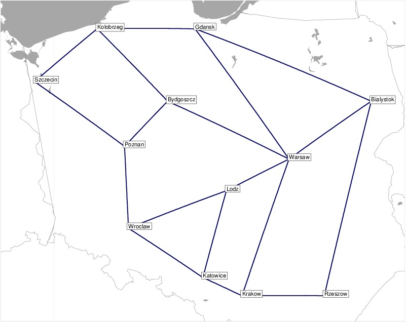

# Projekt na Sieci Sterowane Programowo

## Topologia

W naszym rozwiązaniu użyjemy [topologii polskiej](https://sndlib.put.poznan.pl/home.action?fbclid=IwZXh0bgNhZW0CMTEAAR3tA3f6QjfDBMvHCTL5tdeqrTLAXejLmolCGpzL3xaQmjhuOEpV4jYTQyM_aem_m1RIC6h83HPIrBJi2hVbdQ)

## Instalacja
Aby pobrać projekt w środowisku Floodlight VM należy wpisać w konsoli `git clone https://github.com/kpekala/floodlight-sdn-project.git` 

Skrypt python służący do instalacji urządzeń mininet znajduje się w katalogu mininet/init_net.py. 

Aby go uruchomić wystarczy wpisać w konsoli `sudo python ./mininet/init_net.py` 
Warto po każdym uruchomeniu wpisać `sudo mn -c` aby wyczyścić środowisko mininet
